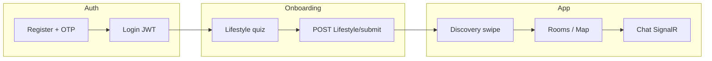

# SacoStay UI — Cấu trúc project & cách FE khớp Backend

Tài liệu này mô tả **SacoStayUI** (Angular) và cách frontend gọi **SacoStayAPI** (.NET 8). Chi tiết từng endpoint xem thêm `Backend_Json.md` (Swagger) và `API_BACKEND_SYNC.md` (bảng đồng bộ nhanh).

---

## 1. Hai repo trong hệ thống

| Repo | Vai trò | Chạy local |
|------|---------|------------|
| **SacoStayUI** (repo này) | SPA Angular — giao diện người dùng | `npm run start` → http://localhost:4200 |
| **SacoStayAPI** (thường cùng thư mục `SacoStay/`) | REST API + SignalR + PostgreSQL (Neon) | Visual Studio profile **http** → http://localhost:5219 |

**Production**

| Thành phần | URL |
|------------|-----|
| Frontend | https://sacostay.id.vn (hoặc https://www.sacostay.id.vn) |
| API | https://api.sacostay.id.vn/api |
| Chat real-time | https://api.sacostay.id.vn/chatHub |

Cấu hình URL nằm ở `src/environments/` (xem mục 3).

---

## 2. Cấu trúc thư mục SacoStayUI

```
SacoStayUI/
├── public/                    # Asset tĩnh (nếu có)
├── src/
│   ├── index.html             # Shell HTML, favicon SacoStay
│   ├── main.ts                # Bootstrap + applyProductionHostIfNeeded()
│   ├── styles.css             # Global CSS + Tailwind
│   ├── environments/          # apiUrl, appUrl, chatHubUrl
│   └── app/
│       ├── app.ts             # Root: Activity ping, chat unread, notifications
│       ├── app.config.ts      # Router, HttpClient, interceptor, zoneless
│       ├── app.routes.ts      # Toàn bộ route + guard
│       ├── core/
│       │   ├── guards/        # auth, tenant, landlord, admin
│       │   └── interceptors/  # Gắn JWT Bearer vào HTTP
│       ├── models/            # TypeScript theo domain (auth, room, chat…)
│       ├── services/          # Gọi API — lớp quan trọng nhất với BE
│       ├── utils/             # Helper: user-display, storage, map, quiz…
│       ├── components/        # UI tái sử dụng (navbar, modal, toast…)
│       └── pages/             # Màn hình theo route (lazy load)
├── angular.json               # Build production / serve local (4200)
├── tailwind.config.js
├── API_BACKEND_SYNC.md        # Bảng API ↔ FE (ngắn)
├── Backend_Json.md            # Swagger export (đầy đủ)
└── PROJECT_GUIDE.md           # File này
```

### Nguyên tắc tổ chức code

- **Page** = một route (`pages/<tên>/`). Chỉ orchestration UI + gọi service.
- **Service** = mọi `HttpClient` / SignalR tới BE. Không gọi API trực tiếp từ template.
- **Model** = interface DTO; service map cả `camelCase` và `PascalCase` từ JSON .NET.
- **Utils** = logic thuần (không HTTP): hiển thị tên, localStorage, filter discovery.

---

## 3. Environment & build

| File | Khi nào dùng |
|------|----------------|
| `environment.development.ts` | `npm run start` — API `http://localhost:5219` |
| `environment.production.ts` | `npm run build` — API production |
| `environment.ts` | Base; production build thay bằng file production |
| `apply-production-host.ts` | Trên domain `sacostay.id.vn` / `www` — ép URL API production (tránh bundle cũ còn localhost) |

**Lệnh thường dùng**

```bash
npm run start          # Test local, cổng 4200
npm run build          # Deploy lên host tĩnh (dist/SacoStayUI/browser)
```

`angular.json`: profile `local` / `development` → development env; `production` → production env.

---

## 4. Khởi động app (FE)

```
main.ts
  → applyProductionHostIfNeeded()   # Sửa environment nếu chạy trên domain thật
  → bootstrapApplication(App)

app.ts (ngOnInit)
  → ActivityService.start()       # POST /api/Activity/ping mỗi 30s (online)
  → ChatUnreadService             # Badge tin nhắn chưa đọc
  → NotificationCenterService     # Poll thông báo + SignalR

app.config.ts
  → provideRouter(routes)
  → provideHttpClient + authInterceptor   # Header Authorization: Bearer <token>
  → zoneless change detection
```

**Toast / xác nhận:** `UiToastService` + `UiConfirmService` (global trong `app.html`) — thay `alert()` / `confirm()` trình duyệt.

---

## 5. Xác thực & phân quyền (FE ↔ BE)

### BE (`AuthController`)

| Hành động | API | Ghi chú |
|-----------|-----|---------|
| Đăng ký | `POST /api/Auth/register` | Trả message; gửi OTP email |
| Xác nhận email | `POST /api/Auth/verify-email-otp` | Query `email`, `otp` |
| Đăng nhập | `POST /api/Auth/login` | Body: `emailPhoneorUsername`, `password` — email **hoặc** username **hoặc** SĐT |
| Hồ sơ mình | `GET /api/Auth/profile` | Bearer |
| Hồ sơ công khai | `GET /api/Auth/user/{userId}` | Chat, discovery — có `lastSeenAt`, `isOnline` |
| Cập nhật hồ sơ | `PUT /api/Auth/update-profile` | FormData (ảnh + field) |
| Quên MK | `POST /api/Auth/forgot-password` → OTP → `reset-password` | |

JWT lưu FE: `localStorage` key `saco_stay_token`. Interceptor đính kèm mọi request (trừ login/register).

### FE guards (`core/guards/`)

| Guard | Điều kiện |
|-------|-----------|
| `authGuard` | Có token |
| `tenantGuard` | Role tenant (discovery) |
| `landlordGuard` | Role landlord |
| `adminGuard` | Role admin → panel `/admin` |

Sau login, `AuthService.refreshProfile()` nạp user + role; admin redirect `/admin`.

---

## 6. Bản đồ Service → API Backend

Mỗi service dùng `environment.apiUrl` (luôn có suffix `/api`).

| Service FE | Controller BE (gợi ý) | Chức năng |
|------------|----------------------|-----------|
| `AuthService` | `Auth` | Login, register, profile, OTP, reset password |
| `LifestyleService` | `Lifestyle` | Quiz, submit answers, swipe deck, quota, admin CRUD câu hỏi |
| `RoomPostService` | `RoomPost` | Tìm phòng, tạo/sửa tin, analytics, view |
| `PaymentService` | `Payment` | PayOS landlord/tenant package |
| `ChatService` | `Chat` | Lịch sử tin nhắn REST |
| `ChatHubService` | Hub `ChatHub` | Gửi/nhận tin real-time (SignalR) |
| `ChatPeerProfileService` | `Auth/user/{id}` | Tên + avatar người chat |
| `PresenceService` | `Activity/presence`, fallback `Auth/user` | Online/offline |
| `ActivityService` | `Activity/ping` | Ping hoạt động (app root) |
| `NotificationService` | `Notification` | Danh sách, đọc, unread count |
| `ReportService` | `Report` | User/room report (multipart) |
| `AdminService` | `Admin` | Dashboard, users, duyệt tin, xử lý report |
| `UserProfileImagesService` | `User/profile-images` | Ảnh profile gallery |
| `DiscoveryProfileService` | `Auth/user`, `Lifestyle/match` | Card swipe + % match |

**Media URL:** Ảnh S3/relative — `utils/media-url.ts` ghép base từ `apiUrl` (bỏ `/api`).

---

## 7. Luồng nghiệp vụ chính

### 7.1 Người thuê (tenant)



| Bước | Trang FE | API chính |
|------|----------|-----------|
| Đăng ký / OTP | `/register`, `/otp-verification` | `Auth/register`, `verify-email-otp` |
| Trắc nghiệm | `/lifestyle-quiz` | `GET Lifestyle/questions`, `POST Lifestyle/submit` — chọn đáp án rồi bấm **Tiếp theo** |
| Tìm bạn | `/discovery` | `GET Lifestyle/swipe-deck`, `POST Lifestyle/swipe`, `GET swipe-quota` |
| Xem phòng | `/rooms`, `/rooms/:id`, `/map` | `GET RoomPost/search-nearby` |
| Premium | `/tenant-pricing` | `POST Payment/buy-tenant-package` → PayOS |
| Chat | `/chat` | `Chat/history` + `/chatHub` |

### 7.2 Chủ trọ (landlord)

| Trang | Route | API chính |
|-------|-------|-----------|
| Hồ sơ | `/landlord-profile` | `Auth/profile`, `update-profile` |
| Đăng tin | `/create-listing` | `POST RoomPost/create` (multipart) |
| Tin của tôi | `/my-listings`, `/owner/my-posts` | `GET RoomPost/my-posts`, approve flow qua admin |
| Gói VIP | `/landlord-pricing` | `POST Payment/buy-landlord-package` |
| Người xem tin | `/listing-viewers` | `RoomPost/{id}/analytics` |
| Chat | `/landlord-chat` | Cùng `ChatComponent`, `data.shell = landlord` |

Duyệt tin: **Admin** `POST Admin/room-posts/{id}/approve|reject` — không qua `RoomApproval` trên FE.

### 7.3 Admin

| Tab | FE | API |
|-----|-----|-----|
| Tổng quan | `admin-dashboard` | `GET Admin/dashboard` |
| Duyệt tin | pending tab | `GET Admin/room-posts`, approve/reject |
| Users | users tab | `GET Admin/users` |
| Báo cáo | user-reports / room-reports | `GET Report`, `POST Admin/reports/{id}/process` |
| CMS quiz | `admin-lifestyle-quiz` | `Lifestyle/question`, `options` |

---

## 8. Chat & trạng thái online

1. **Danh sách hội thoại:** FE lưu contact trong `localStorage` (`chat-contacts-storage`) + merge `GET Chat/conversations` nếu BE trả về.
2. **Tin nhắn:** `GET Chat/history/{otherUserId}`; gửi qua **SignalR** `ChatHub.SendPrivateMessage` (token query `access_token`).
3. **Online:** `ActivityService` ping → BE cập nhật `LastSeenAt`. Chat poll `POST Activity/presence` hoặc đọc `isOnline` từ `Auth/user/{id}` (online nếu &lt; 2 phút).

Hub URL: `environment.chatHubUrl` (production: `https://api.sacostay.id.vn/chatHub`).

---

## 9. Báo cáo (report)

- Modal: `components/shared/report-modal` — `POST /api/Report` (FormData: lý do, mô tả, ảnh).
- Admin: tab báo cáo phòng (`reportedRoomId` có) vs báo cáo user (không có `reportedRoomId`).
- Xử lý: `POST /api/Admin/reports/{id}/process` — `{ isValid: true|false }` → ẩn tin, email cảnh báo, khóa tài khoản lần 2.

---

## 10. Thanh toán PayOS

1. FE gọi `Payment/buy-landlord-package` hoặc `buy-tenant-package` → nhận URL PayOS → redirect.
2. PayOS callback → BE `GET Payment/payos-return` → redirect FE `/payment/result?...`.
3. Cấu hình BE: `PayOS:ReturnUrl` trỏ `https://api.sacostay.id.vn/api/Payment/payos-return`.

---

## 11. Cấu hình Backend để FE chạy được

### Local (Visual Studio)

1. `appsettings.Local.json` (copy từ `appsettings.Local.json.example`) — **gitignore**.
   - `ConnectionStrings:DefaultConnection` (Neon PostgreSQL)
   - `Jwt:Key`, `Smtp`, `PayOS`, …
2. `ASPNETCORE_ENVIRONMENT=Development` → CORS cho `http://localhost:4200`.
3. Chạy migration DB nếu cần: `dotnet ef database update`.

Nếu thiếu connection string, API dừng ở `Program.cs` với message *"Thiếu ConnectionStrings:DefaultConnection"*.

### Production server

- Biến môi trường: `ConnectionStrings__DefaultConnection`, `Jwt__Key`, …
- `appsettings.Production.json`: CORS `https://www.sacostay.id.vn`, `https://sacostay.id.vn`.
- Publish API + deploy FE static từ `npm run build`.

---

## 12. Danh sách route FE (tóm tắt)

| Nhóm | Routes |
|------|--------|
| Auth | `/login`, `/register`, `/otp-verification`, `/forgot-password`, `/verify-reset-otp`, `/reset-password` |
| User | `/`, `/profile-setup`, `/profile/:id`, `/lifestyle-quiz`, `/discovery`, `/tenant-pricing` |
| Phòng | `/rooms`, `/rooms/:id`, `/map` |
| Landlord | `/landlord-profile`, `/my-listings`, `/owner/my-posts`, `/create-listing`, `/landlord-pricing`, `/listing-viewers`, `/landlord-chat` |
| Chat | `/chat` |
| Admin | `/admin` |
| Khác | `/terms`, `/payment/result`, `/chat` |

---

## 13. File tham khảo khi sửa code

| File | Mục đích |
|------|----------|
| `API_BACKEND_SYNC.md` | Checklist API đã nối FE |
| `Backend_Json.md` | Contract Swagger đầy đủ |
| `src/app/app.routes.ts` | Route + guard |
| `src/app/services/*.service.ts` | Điểm gọi API — sửa đầu tiên khi đổi BE |
| `src/environments/` | Đổi URL API / hub |
| `SacoStayAPI/Program.cs` | CORS, DI, seed, connection string |

---

## 14. Quy ước khi thêm tính năng mới

1. Thêm endpoint trên **SacoStayAPI** + cập nhật Swagger / `Backend_Json.md`.
2. Thêm interface trong `src/app/models/`.
3. Thêm method trong **service** tương ứng (map PascalCase/camelCase).
4. Page gọi service; dùng `UiToastService` cho thông báo.
5. Route mới khai báo trong `app.routes.ts` + guard phù hợp.
6. Ghi một dòng vào `API_BACKEND_SYNC.md`.

Như vậy FE và BE luôn khớp qua một lớp service rõ ràng, dễ review và deploy tách biệt (UI static + API riêng).
